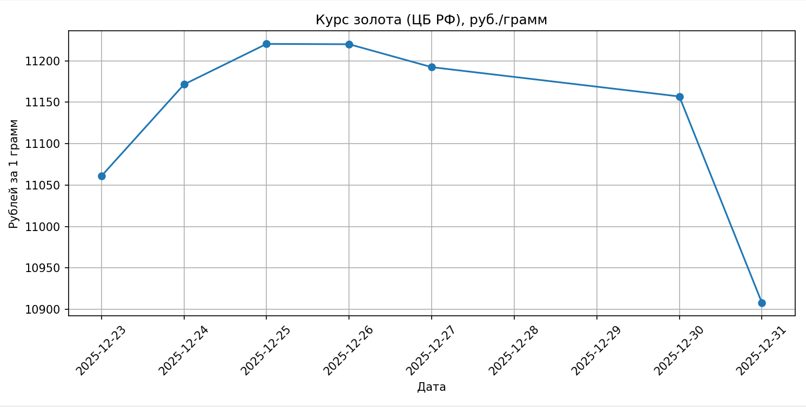

# Gold Price Scraper

Скрипт для получения **учётной цены золота** с сайта  
**Центрального банка РФ** и построения графика.

Источник данных:  
[https://www.cbr.ru/hd_base/metall/metall_base_new/](https://www.cbr.ru/hd_base/metall/metall_base_new/)

Цена публикуется в **рублях за 1 грамм**.

Установка и использование

### Установите зависимости из `requirements.txt`:
    pip install -r requirements.txt
### Загрузка данных:
    python scraper.py
### Результат:
создаётся файл data/gold.json
### Построение графика:
    python plot.py

Этот проект распространяется под лицензией MIT.
Подробности см. в файле [LICENSE](./LICENSE).

